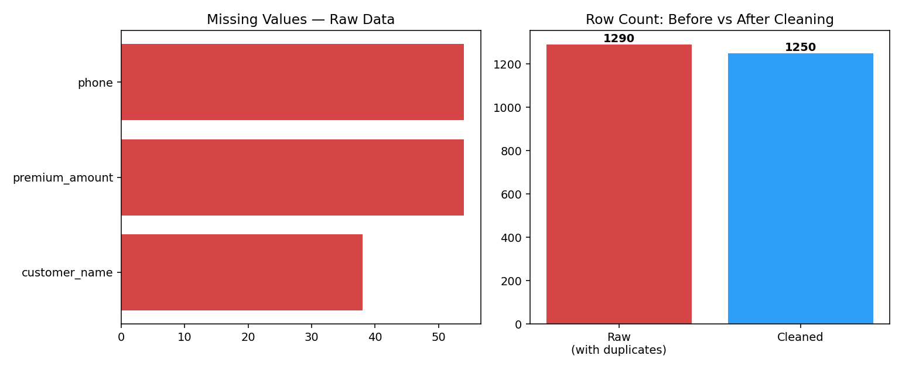

# 🧹 Insurance Sales Data Cleaning Pipeline

A hands-on data cleaning project using a synthetic (but realistic) insurance sales dataset — built to practice and demonstrate core data-cleaning skills on the kind of messy data commonly found in real insurance sales operations.



## 📌 Business Problem

Raw sales data collected across branches and agents is rarely analysis-ready. Inconsistent date formats, free-text currency values, duplicate entries, and invalid fields silently break downstream reporting and KPI calculations (e.g. GWP, conversion rate, retention). This project simulates that exact scenario and builds a repeatable cleaning pipeline to turn messy raw records into an analysis-ready dataset.

## 📂 Dataset

A synthetic insurance sales dataset (**1,290 rows**, 11 columns) generated to mimic real-world messiness:

| Column | Description |
|---|---|
| `policy_id` | Unique policy identifier |
| `customer_name` | Customer full name |
| `phone` | Customer phone number |
| `customer_age` | Customer age |
| `policy_type` | Life / Health / Motor / Fire / Travel / Liability |
| `branch` | Sales branch/city |
| `sale_date` | Date of sale |
| `premium_amount` | Gross premium (GWP) |
| `seller_name` | Sales agent name |
| `status` | Active / Cancelled / Renewed / Expired |
| `payment_method` | Cash / Credit Card / Bank Transfer / Installment |

**Intentional data quality issues included:**
- 4 different date formats mixed together
- Inconsistent text casing and typos (`Life` / `life` / `LIFE`, `Liabilty`, `Esfahan`)
- Premium values with commas, currency text (`تومان`), blanks, and invalid negatives
- Phone numbers in multiple formats (`+98...`, `0098...`, `09...`, with/without dashes)
- Unrealistic outlier ages (e.g. `-5`, `150`)
- ~40 exact duplicate rows

## 🛠️ Approach

The cleaning pipeline (in [`notebooks/data_cleaning.ipynb`](notebooks/data_cleaning.ipynb)) follows these steps:

1. Remove exact duplicate rows
2. Standardize categorical text fields (casing + typo correction)
3. Trim and clean customer name whitespace
4. Parse multiple date formats into a single `datetime` type
5. Clean and convert premium amounts to numeric (strip currency text/commas, handle invalid values)
6. Normalize phone numbers to a single format
7. Flag and correct unrealistic age outliers
8. Apply a missing-value strategy: drop rows missing critical fields (sale date), median-impute premium by policy type, and flag rows with missing contact info rather than discarding them
9. Validate final data quality
10. Export the cleaned dataset

## 📊 Result

| Metric | Value |
|---|---|
| Raw rows | 1,290 |
| Duplicate rows removed | 40 |
| Rows dropped (invalid sale date) | 0 |
| Final cleaned rows | 1,250 |
| Invalid ages corrected | 27 |
| Invalid/missing phones after cleaning | 53 |
| Columns fully validated | 12 (incl. new `missing_contact_info` flag) |

## 🚀 How to Run

```bash
pip install -r requirements.txt
jupyter notebook notebooks/data_cleaning.ipynb
```

## 📁 Project Structure

```
insurance-sales-data-cleaning/
├── README.md
├── requirements.txt
├── data/
│   ├── raw_insurance_sales.csv
│   └── cleaned_insurance_sales.csv
├── notebooks/
│   └── data_cleaning.ipynb
└── images/
    └── before_after_summary.png
```

## 🔧 Tech Stack

Python · Pandas · NumPy · Matplotlib · Jupyter

---

*Part of a data & analytics portfolio at the intersection of insurance sales operations and data science.*
